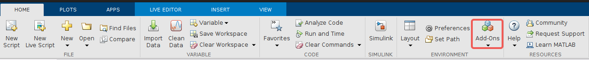
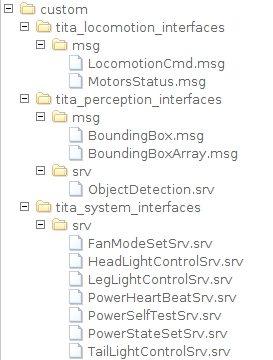
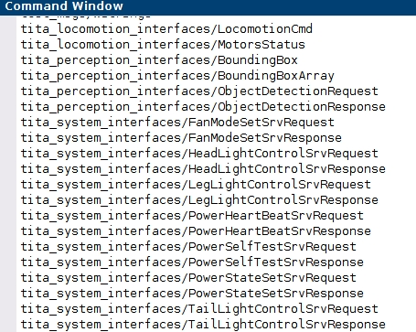
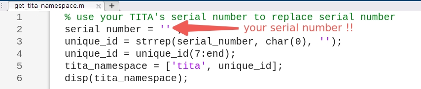
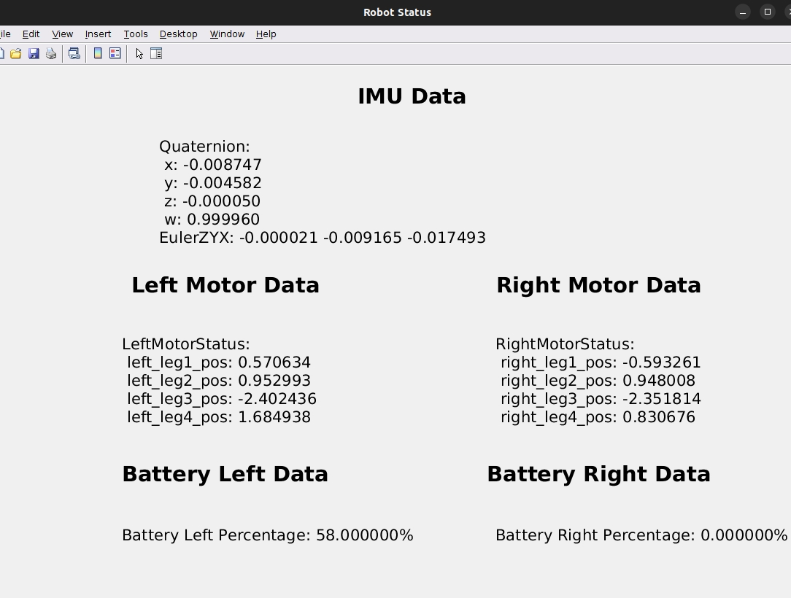
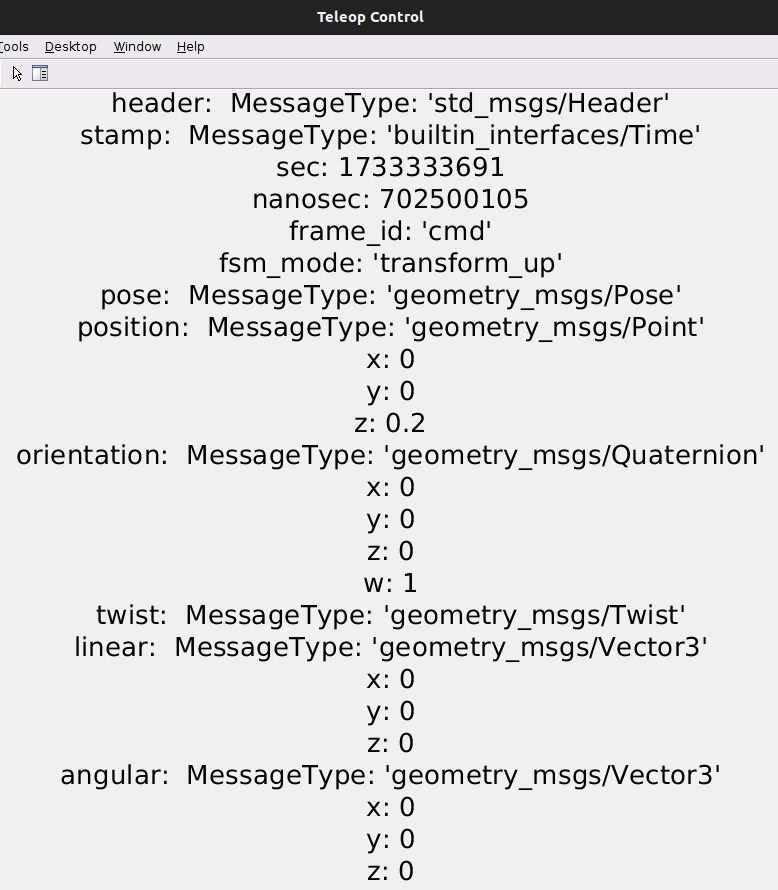
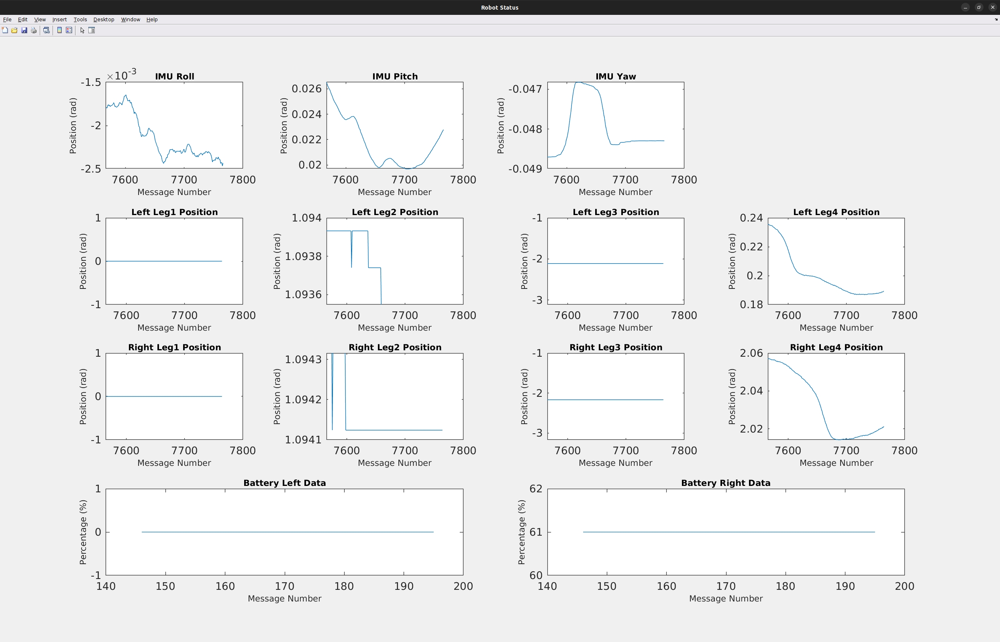

# TITA ROS2 -- MATLAB SDK 
## 开发与使用环境

TITA MATLAB SDK 使用 MATLAB R2022a 和 ROS Toolbox 开发和测试。与其他 MATLAB 版本的兼容性可能会有所不同，并且尚未经过明确测试。我们建议您使用 MATLAB R2022a 或更高版本。您可以从 [ROS Toolbox — Functions](https://ww2.mathworks.cn/help/ros/referencelist.html?type=function&s_tid=CRUX_topnav)查看 ROS Toolbox中的函数以及它们兼容的版本

TITA MATLAB SDK was developed and tested using MATLAB R2022a with the ROS Toolbox. Compatibility with other MATLAB versions may vary and has not been explicitly tested. We recommend using MATLAB R2022a or later version.For a comprehensive list of functions available in the ROS Toolbox and their corresponding compatible MATLAB versions in [ROS Toolbox — Functions](https://ww2.mathworks.cn/help/ros/referencelist.html?type=function&s_tid=CRUX_topnav).
## MATLAB安装ROS Toolbox
MATLAB安装
[ROS Toolbox](https://ww2.mathworks.cn/help/ros/index.html?s_tid=CRUX_lftnav)



点击Add-ons，搜索ROS Toolbox，点击Install即可
## 配置
### MATLAB ROS2 自定义消息
关于MATLAB ROS2 自定义消息，您可以查看reference/ROS2CustomMessagesExample.mlx。

将[TITA_ros2](https://github.com/DDTRobot/TITA-SDK-ROS2)中定义的消息加入到/custom文件夹中（文件结构如下所示）



运行**tita_ros2genmsg.m**来指定自定义消息文件的文件夹路径，该脚本使用ros2genmsg为MATLAB创建自定义消息。

调用ros2 msg list以验证新自定义消息的创建。
```bash
ros2 msg list
```



### 配置ROS_DOMAIN_ID

需要保证主机与机器人连接同一局域网，并且DOMAIN ID相同。检查**机器人**的DOMAIN ID，打开**终端**，输入 

```bash
echo $ROS_DOMAIN_ID
```

在MATLAB Command Window 检查主机的ROS2 DOMAIN ID

```bash
getenv("ROS_DOMAIN_ID")
```

如果两者不同可以使用setenv命令设置DOMAIN ID（以25为例）

```bash
setenv("ROS_DOMAIN_ID","25")
```

ROS_DOMAIN_ID配置完毕
，您现在可以使用ros2 node list来查看当前DOMAIN ID中的节点

```bash
ros2 node list
```

**注意**：您可以使用下面指令重置ROS_DOMAIN_ID为默认 
```bash
 setenv("ROS_DOMAIN_ID","")
```

### 启动TITA MATLAB SDK
在机器人中使用下面指令来打印机器人序列号
```bash
cat /proc/device-tree/serial-number
```

用查看得到的机器人序列号填入**get_tita_namespace.m**中




使用机器人遥控器启用**use-sdk mode**，具体请参考[tita_ros2](https://github.com/DDTRobot/TITA-SDK-ROS2)

现在您可以MATLAB启动**tita_teleop_ctrl.m**使用键盘控制TITA

**注意**：该例程需要使用**Esc**按键退出虚拟遥控器

```text
% w:Control the robot to move forward. (-3.0 ~ +3.0 m/s);
% s:Control the robot to move backward. (-3.0 ~ +3.0 m/s); 
% a:Control the robot to turn left. (-6.0 ~ +6.0 radians/s) 
% d:Control the robot to turn right. (-6.0 ~ +6.0 radians/s) 
% q:Control the robot to tilt left. 
% e:Control the robot to tilt right. 
% r:Adjusts the body tilt angle to horizontal. 
% z:Switches the robot to transform_up mode.
% x:Switches the robot to transform_down mode.
% h:Minimum height in transform_up mode. 
% k:Medium height in transform_up mode. 
% j:Maximum height in transform_up mode. 
% u:Control the robot to pitch up. 
% i:Adjusts the body pitch angle to a horizontal. 
% o:Control the robot to pitch down. 
% c:Switches the robot to idle mode.
% Esc:Exits the virtual remote control.
```
**注意**:您可以使用clear命令来清理所有publisher，subscriber和node。
```matlab
 clear
 % tita_ception.m
 % clear ImuSub MotorSub BatteryLeftSub BatteryRightSub matlab_tita_ception_node; 

 % tita_ception_show.m
 % clear ImuSub MotorSub BatteryLeftSub BatteryRightSub matlab_tita_ception_show_node; 
```
## MATLAB ROS2节点目录
1.**tita_ception.m**（**tita_ception_show.m** ）使用matlab_tita_ception_node（matlab_tita_ception_show_node）节点订阅话题，并读取IMU，各个关节电机和轮毂电机以及电池信息，将其打印在command window（图窗）中。（使用clear指令来清理subscriber以停止打印）



2.**tita_teleop_node.m** 使用matlab_tita_teleop_node节点发布话题，使用键盘控制机器人运动。



3.**tita_interact.m** 使用matlab_tita_interact_node节点订阅和发布话题，实时绘制机器人状态信息以及使用键盘控制机器人运动。



## 参考资料
ROS工具箱中的函数 [ROS Toolbox — Functions](https://ww2.mathworks.cn/help/ros/referencelist.html?type=function&s_tid=CRUX_topnav)

TITA-SDK-ROS2 [tita_ros2](https://github.com/DDTRobot/TITA-SDK-ROS2)

连接到 ROS 2 网络并建立通信 [Connect to ROS 2 Network and Establish Communication](https://ww2.mathworks.cn/help/ros/gs/ros2-nodes.html)

按版本发布的与 MATLAB 产品兼容的 Python 版本 [Versions of Python Compatible with MATLAB Products by Release](https://ww2.mathworks.cn/support/requirements/python-compatibility.html)